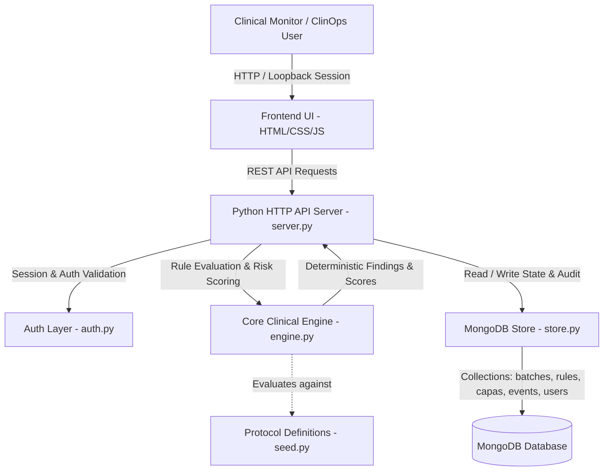

# Architecture

## System Architecture

ArcGuardAI is architected around a clean separation of concerns: a high-performance Python analysis backend, a persistent MongoDB document store, and a reactive, zero-dependency browser frontend styled with a pharma-grade clinical design system.

## Components

| Component | Technology | Responsibility |
|---|---|---|
| **Frontend UI** | HTML5, CSS3, Vanilla ES6 JavaScript | Renders the 8 core clinical screens (Overview, Site Monitor, Deviations, Participant Review, CAPA, Reports, Protocol Rules, Settings) with live search and client routing. |
| **API Server** | Python `http.server` & `urllib` | Exposes REST endpoints (`/api/analysis`, `/api/report`, `/api/export.csv`, `/api/capas`, `/api/reviews`, `/api/protocol`, `/api/audit`), manages HttpOnly session cookies, and enforces Content Security Policy (CSP). |
| **Clinical Engine** | Python 3.11 (`backend/engine.py`) | Pure functions for protocol rule evaluation, deviation classification, visit window calculation, and multi-factor site risk composite scoring. |
| **Persistence Store** | MongoDB & PyMongo (`backend/store.py`) | Manages document collections for study datasets, versioned protocol schemas, human reviews, CAPA lifecycle states, and append-only audit trail records. |
| **Authentication** | PBKDF2 HMAC-SHA256 (`backend/auth.py`) | Provides secure session generation, constant-time password verification, and CSRF token binding for local administrative operations. |

## Data Flow

1. **Client Request**: The browser requests `/api/analysis?asOf=YYYY-MM-DD` with credentials.
2. **Session Verification**: The server checks the `arcguard_session` cookie against MongoDB active sessions.
3. **Engine Evaluation**:
   - Retrieves active protocol rules and patient visit records from the database snapshot.
   - Compares each visit against dosing thresholds, ±day visit windows, and banned medication sets.
   - Calculates site composite risk scores based on leading indicators (unconfirmed visits, query backlogs, untrained staff, deviation counts, data freshness).
4. **Enrichment**: Augments findings with CAPAs, human review decisions, and site metadata.
5. **Response Delivery**: Returns structured JSON payloads or streams generated CSV/inspection exports.
6. **Audit Recording**: Any write action (reviewing a finding, updating protocol parameters, editing a CAPA) creates an immutable audit event in the database.

## Security Considerations

- **Content Security Policy (CSP)**: The server sets strict CSP headers restricting `default-src 'self'`, allowlisting only Google Fonts and Material Symbols stylesheets while disabling inline script execution (`object-src 'none'`, `frame-ancestors 'none'`).
- **Session & CSRF Protection**: Local administrative sessions use `HttpOnly`, `SameSite=Strict` cookies with cryptographically random session tokens and origin/host verification on write requests.
- **Spreadsheet Formula Injection Defense**: When exporting CSV registers, all cell values are sanitized to prevent CSV/formula injection (`=`, `+`, `-`, `@` characters prefixed with single quotes).
- **Data Validation & Sanitization**: Incoming JSON payloads are validated for structure, types, finite numbers, and size limits (max 20 MB) to prevent denial-of-service vulnerabilities.

## Scalability Notes

- **Horizontal API Scaling**: The clinical analysis engine (`engine.py`) is composed of stateless pure functions, enabling seamless horizontal container scaling behind an application load balancer.
- **Caching & Pre-aggregation**: For enterprise trials with 10,000+ participants, site risk scores can be pre-computed incrementally or cached per visit batch using Redis.
- **Integration Extensibility**: The system data models map cleanly to CDISC ODM (Operational Data Model) and FHIR ResearchStudy resources for enterprise EHR/EDC interoperability.
